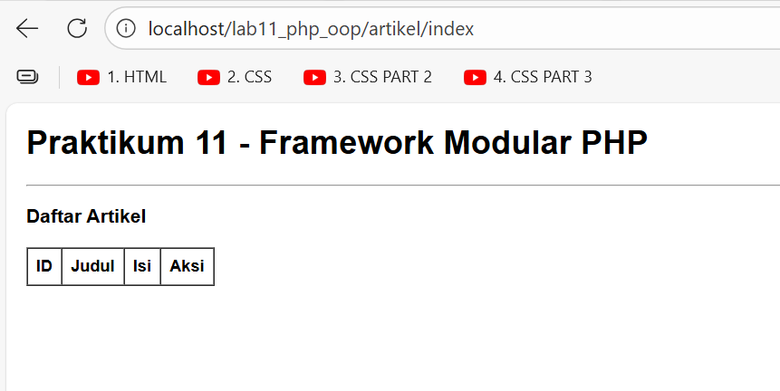
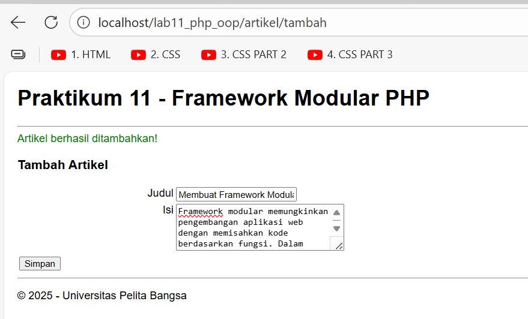
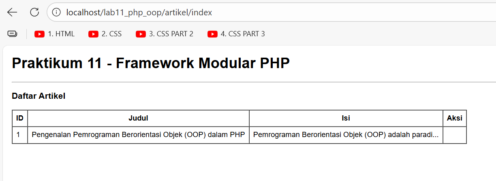

# Praktikum 11: PHP OOP Lanjutan - Modular Framework & Routing

## Tujuan Praktikum
- Memahami konsep dasar Framework Modular
- Memahami konsep dasar routing pada PHP
- Mampu membuat Framework sederhana menggunakan PHP OOP

## Struktur Project
```
lab11_php_oop/ 
├── .htaccess           (Konfigurasi URL Rewrite) 
├── config.php          (Konfigurasi Database) 
├── index.php           (Gerbang Utama / Routing) 
├── class/              (Tempat menyimpan Library) 
│   ├── Database.php 
│   └── Form.php 
├── module/             (Tempat modul-modul website) 
│   └── artikel/ 
│       ├── index.php   (Menampilkan data) 
│       ├── tambah.php  (Form tambah) 
│       └── ubah.php 
├── template/           (Bagian layout) 
├── header.php 
├── footer.php 
└── sidebar.php         
```

## Penjelasan Kode Utama

### 1. File (`.htaccess`)
```
<IfModule mod_rewrite.c>
    RewriteEngine On
    RewriteBase /lab11_php_oop/
    RewriteCond %{REQUEST_FILENAME} !-d
    RewriteCond %{REQUEST_FILENAME} !-f
    RewriteRule ^(.*)$ index.php/$1 [L]
</IfModule>
```
### Fungsi:
- Mengaktifkan URL rewriting
- Mengarahkan semua request ke index.php (kecuali file/folder yang benar-benar ada)
- Memungkinkan URL bersih seperti /artikel/tambah tanpa .php

### 2. File (`config.php`)
```php
<?php
$config = [
    'host' => 'localhost',
    'username' => 'root',
    'password' => '',
    'db_name' => 'lathhan_oop'
];
?>
```
### Fungsi:
- Menyimpan konfigurasi koneksi database
- Memudahkan perubahan setting database di satu tempat

### 3. File (`index.php (Router)`)
```php
<?php
include "config.php";
include "class/Database.php";
include "class/Form.php";

session_start();

$path = isset($_SERVER['PATH_INFO']) ? $_SERVER['PATH_INFO'] : '/home/index';
$segments = explode('/', trim($path, '/'));

$mod = isset($segments[0]) ? $segments[0] : 'home';
$page = isset($segments[1]) ? $segments[1] : 'index';

$file = "module/{$mod}/{$page}.php";

include "template/header.php";

if (file_exists($file)) {
    include $file;
} else {
    echo '<div class="alert alert-danger">Modul tidak ditemukan...</div>';
}

include "template/footer.php";
?>
```
### Penjelasan Routing:
1. $_SERVER['PATH_INFO'] menangkap path setelah index.php/
2. Contoh URL: localhost/lab11_php_oop/artikel/tambah
- Path: /artikel/tambah
- Modul: artikel
- Page: tambah
3. Router akan mencari file: module/artikel/tambah.php

### 4. Class ('form.php')
```php
class Form
{
    private $fields = array();
    private $action;
    private $submit = "Submit Form";
    private $jumField = 0;

    public function __construct($action, $submit) { ... }
    
    public function displayForm() { ... }
    
    public function addField($name, $label, $type = "text", $options = array()) { ... }
}
```
### Fitur:
- Membuat form dinamis dengan berbagai tipe input (text, textarea, select, radio, checkbox)
- Metode addField() untuk menambah field form
- Metode displayForm() untuk menampilkan form HTML

### 5. Class (`database.php`)
```php
class Database
{
    protected $conn;

    public function __construct() { ... }  // Koneksi database
    public function query($sql) { ... }    // Eksekusi query
    public function get($table, $where = null) { ... }  // Ambil satu data
    public function insert($table, $data) { ... }       // Insert data
    public function update($table, $data, $where) { ... } // Update data
}
```
### Motode CRUD:
- get(): SELECT data dengan kondisi WHERE
- insert(): INSERT data ke tabel
- update(): UPDATE data dengan kondisi WHERE

### 6. Module ('artikel/index.php')
```php
<?php
$db = new Database();
$artikel = $db->query("SELECT * FROM artikel");
?>
```
### Fungsi:
- Mengambil semua data artikel dari database
- Menampilkan dalam tabel HTML

### 7. Modul ('artikel/tambah.php')
```php
<?php
$db = new Database();
$form = new Form("", "Simpan");

if ($_POST) {
    $data = ['judul' => $_POST['judul'], 'isi' => $_POST['isi']];
    $db->insert('artikel', $data);
}
?>
```
### Flow:
1. Buat objek Form dan Database
2. Jika form disubmit ($_POST), proses penyimpanan
3. Tampilkan form untuk input data

## Screenshot Implementasi
1. index.php


2. tambah


3. Halaman daftar Artikel


## Akses:
http://localhost/lab11_php_oop/artikel/index

## Kesimpulan
Framework modular ini menunjukkan bagaimana aplikasi web dapat diorganisir dengan baik menggunakan PHP OOP. Dengan struktur yang terorganisir, pengembangan menjadi lebih mudah, maintenance lebih sederhana, dan fitur baru dapat ditambahkan tanpa mengganggu kode yang sudah ada.